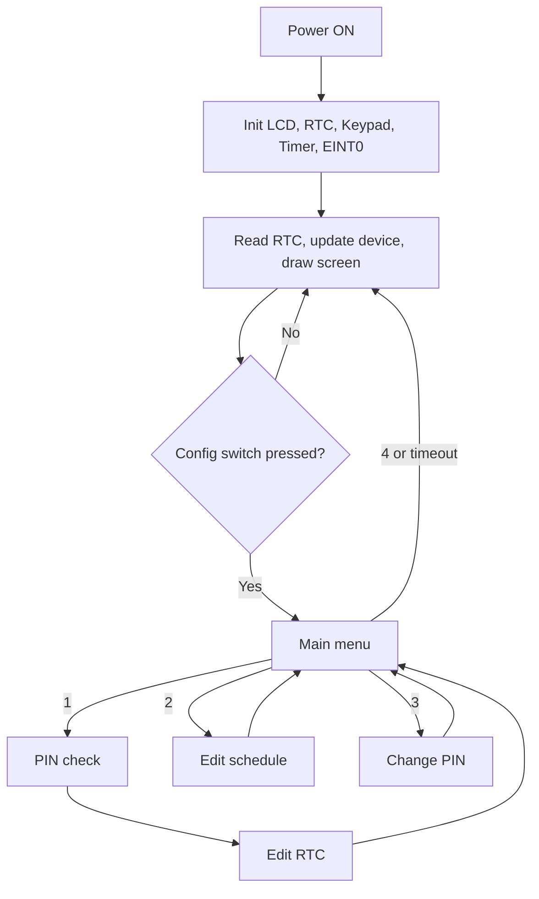

# ⏰ PIN-Protected RTC Configuration & Scheduled Device Control


A 16×2 LCD shows the live date and time. A 4×4 keypad menu, **locked behind a 4-digit PIN**, lets you set the clock and a daily ON/OFF schedule. The board then switches a device (LED, relay, etc.) automatically.

## 📑Contents

· [At a Glance](#at-a-glance) 
· [Aim](#aim) 
· [Features](#features) 
· [Hardware](#hardware-required) 
· [Block Diagram and Hardware Connections Image](#block-diagram-and-hardware-connections)
· [Pin Mapping](#pin-mapping) 
· [Wiring](#circuit-connections) 
· [Getting Started](#getting-started) 
· [Firmware](#firmware-architecture) 
· [LCD Screens](#lcd-screens) 
· [Menu](#menu-system) 
· [Keypad](#keypad-guide) 
· [PIN & Lockout](#pin-and-lockout) 
· [Schedule Logic](#schedule-logic) 
· [Validation](#input-validation) 
· [Power-Off](#time-across-power-off) 
· [Testing](#testing-checklist) 
· [Troubleshooting](#troubleshooting) 
· [Structure](#project-structure) 
· [Source Overview](#source-code-overview)
· [Specs](#technical-specifications) 
· [Limitations](#known-limitations) 
· [Future Work](#future-enhancements)
· [Author](#author)

## 🚀 At a Glance

| | |
|---|---|
| **What it does** | Shows clock → PIN-protected setup → controls a device by schedule |
| **Controller** | LPC2148 (ARM7TDMI-S, 60 MHz) with on-chip RTC |
| **Input** | 4×4 keypad + 1 config push-button (EINT0) |
| **Output** | 16×2 LCD + device output (active LOW) |
| **Tools** | Embedded C · Keil µVision · Flash Magic |
| **Code** | Multi-file: `main.c` + `rtc`, `KPM`, `LCD`, `eint`, `timer`, `iap`, `delay` drivers |

## 🎯Aim

Build a menu-driven RTC and scheduled device controller on the LPC2148, with PIN-protected access to the clock settings.

## ✨Features

| Feature | Description |
|---|---|
| **Live clock** | `HH:MM:SS DAY ON/OFF` on line 1; line 2 alternates between date and schedule |
| **Interrupt-driven menu** | The EINT0 ISR only sets a flag; all menu work runs in `main()` |
| **PIN-protected RTC edit** | 4-digit PIN needed before changing the clock |
| **PIN change** | Old PIN required first |
| **Lockout** | 3 wrong PINs → 30 s lock with live countdown |
| **Explicit confirm** | Nothing is saved until `=` is pressed |
| **Backspace** | `C` erases one digit; on an empty field it cancels |
| **Smart schedule** | Works for same-day and overnight (across midnight) windows |
| **Strict validation** | Rejects out-of-range values, invalid dates (leap-year aware) and ON = OFF |
| **Timeouts** | 10 s idle timeout on the menu and on every field |
| **Flash storage (optional)** | Schedule survives reset using IAP |
| **Modular drivers** | Separate LCD, keypad, RTC, timer, interrupt and IAP modules |

## 📐Block Diagram and Hardware Connections

<table>
  <tr>
    <td align="center">
<br><sub><b>Block diagram</b><br>Power, MCU, input, output, flash</sub></td>
    <td align="center"><sub><b>Hardware Connections</b><br>Pin-level wiring</sub></td>
  </tr>
</table>

## 🧩Hardware Required

| Component | Notes | Qty |
|---|---|---|
| LPC2148 development board | ARM7TDMI-S, 60 MHz (PLL), on-chip RTC | 1 |
| 16×2 LCD | HD44780 compatible, 8-bit mode | 1 |
| 4×4 matrix keypad | Membrane or tactile | 1 |
| LED or relay module | The controlled device (active LOW) | 1 |
| Push button | Wired to EINT0 (P0.1) | 1 |
| USB-UART / ISP interface | For Flash Magic programming | 1 |
| Power supply | 3.3 V regulated (+5 V for LCD if needed) | 1 |
| Potentiometer 10 kΩ | LCD contrast (V0) | 1 |
| Resistor 330 Ω | LED series resistor | 1 |
| 3 V coin cell | On VBAT, keeps RTC data when powered off | 1 |
| Pull-up resistors 10 kΩ | Config switch, keypad columns (if not on board) | as needed |

**Software:** Keil µVision (compile/debug), Flash Magic (programming), `lpc21xx.h` (register definitions).

## 📌Pin Mapping

| Function | Pin | Direction | Notes |
|---|---|---|---|
| LCD D0–D7 | P0.8 – P0.15 | Out | 8-bit parallel |
| LCD RS | P0.16 | Out | Register select |
| LCD RW | P0.17 | Out | Held LOW (write only) |
| LCD EN | P0.18 | Out | Enable strobe |
| Keypad rows R0–R3 | P1.16 – P1.19 | Out | Driven low one at a time |
| Keypad columns C0–C3 | P1.20 – P1.23 | In | Read back during scan |
| Config switch | P0.1 (EINT0) | In | Falling-edge interrupt |
| Device output | P0.4 | Out | **LOW = ON, HIGH = OFF** |

> ⚠️ **P0.14 is also the ISP-entry pin.** The LCD uses P0.14 as data line D6. Make sure the LCD does not hold P0.14 LOW while the board resets, or it will enter ISP mode instead of running your program.

## 🔌Circuit Connections

### 1. LCD (HD44780)

| LPC2148 | LCD |
|---|---|
| P0.8 – P0.15 | D0 – D7 |
| P0.16 | RS |
| P0.17 | RW |
| P0.18 | EN |
| 10 kΩ pot wiper | V0 (contrast) |

<p align="center">

</p>

### 2. Keypad

| LPC2148 | Keypad |
|---|---|
| P1.16 – P1.19 | Rows R0 – R3 |
| P1.20 – P1.23 | Columns C0 – C3 |

<p align="center"></p>

### 3. Device output (active LOW)

The device turns ON when P0.4 goes LOW, so the LED is wired between 3.3 V and P0.4:

| LPC2148 | Active Low Switch |
|---|---|
| P0.4 | Anode(+) of LED |
| GND | Cathode(-) of LED |

<p align="center">
</p>

### 4. Config switch (EINT0)

| LPC2148 | Switch |
|---|---|
| P0.1 | One terminal |
| GND | Other terminal |

Reads HIGH normally. Pressing pulls P0.1 LOW and fires the interrupt.

<p align="center">
</p>

## 🏁Getting Started

1. **Get the files:** all `.c` / `.h` sources plus this README.
2. **Wire the circuit** as shown above. Double-check LCD D0–D7 → P0.8–P0.15 and the keypad rows/columns.
3. **Install** Keil µVision (with LPC2148 support) and Flash Magic.
4. **Create the Keil project:** New µVision Project → NXP → LPC2148 → accept the startup file → add all `.c` files → *Options for Target* → Xtal = **12.0 MHz** → tick **Create HEX File**.
5. **Build:** press `F7`. `0 Error(s)` creates the `.hex` file.
6. **Flash:** put the board in ISP mode, open Flash Magic and set:

   | Setting | Value |
   |---|---|
   | Device | LPC2148 |
   | COM port | Your USB-UART port |
   | Baud rate | Highest rate your hardware supports reliably |
   | Oscillator | 12 MHz |
   | Hex file | The generated `.hex` |
   | Erase | ✅ *Erase blocks used by Hex File only* (keeps a saved schedule) |

   Click **Start**, then switch back to run mode and press Reset.

7. **First run:**

   | # | Do this | Expect this |
   |---|---|---|
   | 1 | Power on | Clock screen |
   | 2 | Press the config switch | Main menu |
   | 3 | Choose `1`, enter PIN `1234` | Field prompts |
   | 4 | Set the current time | Clock updates |
   | 5 | Choose `2`, set ON 1 min ahead and OFF 2 min ahead | Values accepted |
   | 6 | Choose `4` (Exit) | Run screen |
   | 7 | Wait 1 min, then 1 more | Device ON ✅, then OFF ✅ |

## 🧠Firmware Architecture

```
┌───────────────────────────────────────────────┐
│ Application (main.c)                          │
│ banner · run screen · menu · PIN · validation │
├───────────────────────────────────────────────┤
│ Drivers: rtc · KPM · LCD · eint · timer ·     │
│          iap · delay                          │
├───────────────────────────────────────────────┤
│ Hardware: LPC2148 registers (lpc21xx.h)       │
└───────────────────────────────────────────────┘
```

**Main loop:**

```c
while (1) {
    GetRTCTimeInfo(...); GetRTCDateInfo(...); GetRTCDay(...);
    UpdateDevice();      // compare time with schedule, drive output
    ShowStatus();        // redraw only what changed
    if (menuRequest) { menuRequest = 0; ShowMenu(); refreshAll = 1; }
}
```

The EINT0 ISR only sets `menuRequest = 1`. All keypad and LCD work happens back in `main()`.



## 📺LCD Screens

### Run screen and menu

<table>
  <tr>
    <td align="center"><br><sub><b>Run screen</b><br><code>00:00:47 THU OFF</code><br><code>SCHEDULE NOT SET</code></sub></td>
    <td align="center"><br><sub><b>RTC not set</b><br><code>RTC NOT SET</code><br><code>PRESS SW TO SET</code></sub></td>
    <td align="center"><br><sub><b>Main menu</b><br><code>1:RTC 2:SCHD</code><br><code>3:PIN 4:EXIT</code></sub></td>
  </tr>
</table>

### PIN entry and lockout

<table>
  <tr>
    <td align="center"><br><sub><b>PIN entry</b><br><code>ENTER RTC PIN-4D</code></sub></td>
    <td align="center"><br><sub><b>Wrong PIN</b><br><code>WRONG PIN / TRY AGAIN</code></sub></td>
  </tr>
  <tr>
    <td align="center"><br><sub><b>Locked</b><br><code>TOO MANY TRIES / LOCKED 30 SEC</code></sub></td>
    <td align="center"><br><sub><b>Countdown</b><br><code>RTC LOCKED / WAIT 27 SEC</code></sub></td>
  </tr>
</table>

### Change PIN

<table>
  <tr>
    <td align="center"><br><sub><b>New PIN</b><br><code>NEW PIN(4 DIG)</code></sub></td>
    <td align="center"><br><sub><b>Confirm</b><br><code>CONFIRM NEW PIN</code></sub></td>
    <td align="center"><br><sub><b>Done</b><br><code>PIN CHANGED SUCCESSFULLY</code></sub></td>
  </tr>
</table>

### Set the RTC

<table>
  <tr>
    <td align="center"><br><sub><b>Hour</b> (0-23)</sub></td>
    <td align="center"><br><sub><b>Minute</b> (0-59)</sub></td>
    <td align="center"><br><sub><b>Second</b> (0-59)</sub></td>
    <td align="center"><br><sub><b>Day</b> (0 SUN - 6 SAT)</sub></td>
  </tr>
  <tr>
    <td align="center"><br><sub><b>Date</b> (1-31)</sub></td>
    <td align="center"><br><sub><b>Month</b> (1-12)</sub></td>
    <td align="center"><br><sub><b>Year</b> (2000-2030)</sub></td>
    <td align="center"><br><sub><b>Saved</b><br><code>RTC UPDATED</code></sub></td>
  </tr>
</table>

### Set the schedule

<table>
  <tr>
    <td align="center"><br><sub><b>ON hour</b> (0-23)</sub></td>
    <td align="center"><br><sub><b>ON minute</b> (0-59)</sub></td>
    <td align="center"><br><sub><b>OFF hour</b> (0-23)</sub></td>
    <td align="center"><br><sub><b>OFF minute</b> (0-59)</sub></td>
  </tr>
</table>

## 📋Menu System

| Option | Function |
|---|---|
| `1` | Edit RTC (PIN required) |
| `2` | Edit device schedule |
| `3` | Change PIN (current PIN required) |
| `4` | Exit to run screen |

| RTC field | Range |
|---|---|
| Hour | 0 – 23 |
| Minute / Second | 0 – 59 |
| Day of week | 0 – 6 (0 = SUN … 6 = SAT) |
| Date | 1 – 31, checked against month and year (29 Feb only in leap years) |
| Month | 1 – 12 |
| Year | 2000 – 2030 |

| Schedule field | Range |
|---|---|
| ON hour / OFF hour | 0 – 23 |
| ON minute / OFF minute | 0 – 59 |

## Keypad Guide

```
        C0  C1  C2  C3
R0      7   8   9   /
R1      4   5   6   *
R2      1   2   3   -
R3      C   0   =   +
```

| Key | Meaning |
|---|---|
| `0` – `9` | Enter a digit |
| `=` | Confirm the field (nothing is saved before this) |
| `C` | Erase the last digit; on an empty field, cancel and re-prompt |
| `/` `*` `-` `+` | Not used |

## 🔐PIN and Lockout

- Default PIN: **1234** (`RTC_PIN_DEFAULT` in `main.c`).
- The PIN is needed to edit the RTC and to set a new PIN.
- 3 wrong tries in a row lock RTC/PIN editing for **30 s**, with a live countdown. It unlocks by itself.
- The PIN and lock state are stored in **RAM only**. A reset or power cycle sets the PIN back to `1234` and clears any lock.

## 📅Schedule Logic

- **ON is inclusive, OFF is exclusive.** ON 09:00, OFF 17:00 → device is ON from 09:00:00 to 16:59:59.
- **Same-day (ON < OFF):** ON when `now ≥ ON` **and** `now < OFF`.
- **Overnight (ON > OFF):** ON when `now ≥ ON` **or** `now < OFF`.
- **ON = OFF is rejected**, because the period would be unclear.
- The schedule repeats every day.

```
Hour        0  3  6  9  12 15 18 21
Same-day    ░░░░░░░░░████████░░░░░░░    ON 09:00  OFF 17:00
Overnight   ██████░░░░░░░░░░░░░░░░██    ON 22:00  OFF 06:00
            █ = device ON   ░ = device OFF
```

## ✅Input Validation

| Field | Rule |
|---|---|
| Hour | 0 – 23 |
| Minute / Second | 0 – 59 |
| Day of week | 0 – 6 |
| Date | 1 – 31, checked against days in month and leap years |
| Month | 1 – 12 |
| Year | 2000 – 2030 |
| ON / OFF | Range-checked; rejected if identical |
| PIN | Must match 4 digits; 3 wrong tries → 30 s lock |
| Any field | Not saved until `=` is pressed; `C` fixes typos first |

## 🔋Time Across Power-Off

- RTC calendar registers sit in the LPC2148's **VBAT domain**. With a battery on VBAT they keep their value when the main supply is off, and `main()` will not overwrite a valid saved time at boot.
- By default the RTC runs from PCLK, which stops when the board is off. The time is **kept but does not advance** while off.
- For a clock that keeps running while off, fit a **32.768 kHz crystal** on RTCX1/RTCX2 and enable `#define USE_RTC_XTAL` in `rtc.c`.
- With **no VBAT battery**, the registers are lost and the board falls back to `01/01/2026 00:00:00 THU`.

## 🧪Testing Checklist

| # | Test | Expected | Pass |
|---|---|---|---|
| 1 | Power on | Clock screen appears | ☐ |
| 2 | Wait a few seconds | Line 2 alternates date / schedule | ☐ |
| 3 | Press config switch | Menu appears | ☐ |
| 4 | Option 1, wrong PIN × 3 | RTC locks 30 s with countdown | ☐ |
| 5 | Option 1, correct PIN, Hour = 24 | Rejected, re-prompted | ☐ |
| 6 | Set a valid time, confirm | Clock updates | ☐ |
| 7 | Type digits, press `C` repeatedly | Digits erase one by one, then cancel | ☐ |
| 8 | Option 2, ON = OFF | Rejected | ☐ |
| 9 | Option 2, ON +1 min, OFF +2 min | Device switches on schedule | ☐ |
| 10 | Option 3, change PIN, re-enter with new PIN | Accepted | ☐ |
| 11 | Set 30 Feb, or 29 Feb in a non-leap year | Rejected | ☐ |
| 12 | Leave a field idle 10 s | Returns to menu | ☐ |
| 13 | Leave the menu idle 10 s | Returns to run screen | ☐ |
| 14 | Power off and on (VBAT fitted) | Time and date unchanged | ☐ |

## 🔧Troubleshooting

| Problem | Check |
|---|---|
| LCD blank / dark boxes | Contrast pot, VCC/GND, RS/RW/EN wiring |
| LCD shows garbage | D0–D7 order (P0.8–P0.15), RW tied correctly |
| Keypad wrong or no keys | Row/column order, pull-ups on columns |
| Config switch does nothing | Pull-up on P0.1, switch to GND |
| Device works backwards | Active-LOW wiring; or swap `DEVICE_ON()` / `DEVICE_OFF()` in `main.c` |
| Locked out of RTC menu | Wait 30 s |
| Forgot PIN | Default is `1234`; a full reflash resets it |
| Date resets to 01/01/2026 | No battery on VBAT |
| Schedule lost after reset | `USE_IAP` is 0 in `iap.h` |
| Board won't run after reset | P0.14 held LOW at reset (ISP entry) |

## 📁Project Structure

```
project/
├── main.c                          # Menu, PIN, validation, device control
├── rtc.c / rtc.h                   # RTC init, get/set, leap-year helpers
├── KPM.c / KPM.h / KPM_defines.h   # Keypad scanning
├── LCD.c / LCD.h / LCD_defines.h   # LCD driver
├── eint.c / eint.h                 # EINT0 config switch
├── timer.c / timer.h               # Timer0 1 ms tick (timeouts, PIN lock)
├── iap.c / iap.h                   # Flash schedule storage (IAP)
├── delay.c / delay.h               # Blocking delays
├── types.h                         # Type aliases
├── defines.h                       # Bit-manipulation macros
├── README.md
└── images/                         # Screenshots and diagrams (lowercase folder name)
```

## 🔍Source Code Overview

| Function(s) | Purpose |
|---|---|
| `ShowBanner`, `ShowStatus` | Startup banner, run-screen drawing |
| `GetValue`, `ReadField` | Prompted, validated, confirm-with-`=` entry |
| `VerifyPin`, `ChangePin` | PIN check/change with lockout |
| `EditRTC`, `EditSchedule` | Menu options 1 and 2 |
| `ShowMenu` | Menu display and dispatch |
| `UpdateDevice` | Compare schedule with clock, drive output |
| `RTC_Init`, `SetRTC*`, `GetRTC*`, `IsRTCValid`, `DaysInMonth` | RTC driver |
| `InitKPM`, `KeyScanT` | Keypad scan with timeout |
| `EINT0_Enable`, `eint0_isr` | Config-switch interrupt |
| `InitTimer0`, `GetTicks`, `Elapsed` | 1 ms tick for timeouts and PIN lock |
| `IAP_SaveSchedule`, `IAP_LoadSchedule` | Optional flash storage |

## 📊Technical Specifications

| Parameter | Value |
|---|---|
| Microcontroller | NXP LPC2148 (ARM7TDMI-S) |
| CCLK | 60 MHz (PLL ×5 from 12 MHz crystal) |
| PCLK | 15 MHz |
| RTC clock | PCLK prescaler (default); 32.768 kHz optional |
| LCD | 8-bit parallel, HD44780 |
| Keypad | 4×4 matrix scan |
| Interrupt | EINT0, falling edge, VIC vectored |
| Timer | Timer0, free-running 1 ms tick |
| Schedule flash sector | Last user sector (14 @ 256 KB / 26 @ 512 KB), optional |
| Programming | ISP via Flash Magic |

## 🚧Known Limitations

- PIN and lock state are RAM-only and reset on power cycle.
- Schedule storage (IAP) is off by default (`USE_IAP = 0`).
- The RTC does not advance while powered off unless the 32.768 kHz crystal option is used.
- One daily ON/OFF schedule only, with no per-weekday schedules.

## 🔮Future Enhancements

- Save the PIN to flash so it survives reset
- Multiple or per-weekday schedules
- UART logging of configuration changes
- External battery-backed RTC (e.g. DS1307)
- Unit tests for validation and schedule logic

## 👤Author

**Mohammad Hafeez** · [@hafeez25](https://github.com/hafeez25)
